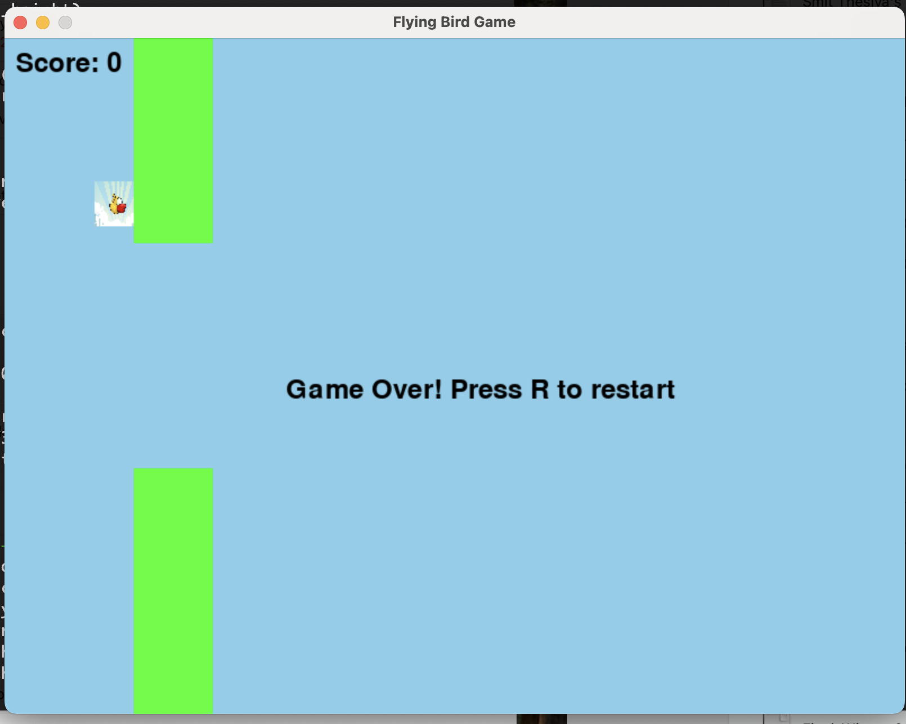

# Flying Bird Game

A classic 2D Flappy Bird-inspired game built with Python and Pygame. Navigate a bird through a series of pipes by jumping with the spacebar, avoiding collisions, and aiming for a high score. Features sound effects, a graphical interface, and a restart option.

 <!-- Replace with an actual screenshot file if you upload one -->

## Features
- **Gameplay**: Control a bird that jumps to avoid pipes, with gravity affecting its movement.
- **Graphics**: Custom bird and background images using Pygame's image loading and scaling.
- **Sound**: Jump and collision sound effects for an immersive experience.
- **Scoring**: Tracks your score as you pass pipes successfully.
- **Restart**: Press 'R' to reset the game after a collision.

## Installation
1. **Prerequisites**:
   - Python 3.x
   - Pygame (`pip install pygame`)
2. **Clone the Repository**:
   ```bash
   git clone https://github.com/Pratham-Gauswami/Flying-Bird-Game.git
   cd Flying-Bird-Game
   ```
3. **Add Assets**:
   - Place `bird.png`, `pipes.png`, `background.png`, `jump.mp3`, and `hit.mp3` in the project directory. (Assets not included—use your own or placeholders.)
4. **Run the Game**:
   ```bash
   python flying_bird_game.py
   ```

## Controls
- **Spacebar**: Make the bird jump.
- **R**: Restart the game after a game over.
- **Quit**: Close the window to exit.

## How It Works
- The bird moves vertically with gravity (`GRAVITY = 0.5`) and jumps with a set strength (`JUMP_STRENGTH = -10`).
- Pipes spawn randomly with a gap (`PIPE_GAP = 200`) and move left at a constant speed.
- Collision detection uses Pygame’s `Rect` for precise hitboxes.
- Score increments when the bird passes a pipe.

## Dependencies
- **Pygame**: For graphics, sound, and game loop management.

## Known Issues
- Custom pipe image (`pipes.png`) is loaded but not fully integrated—currently uses green rectangles.
- No high score persistence yet.

## Future Improvements
- Add high score saving using a file or database.
- Implement smoother animations for the bird and pipes.
- Include difficulty levels (e.g., adjustable pipe speed or gap size).

## Credits
- Developed by Pratham Gauswami.
- Inspired by the classic Flappy Bird game.

## License
This project is open-source under the MIT License. Feel free to fork and modify!
